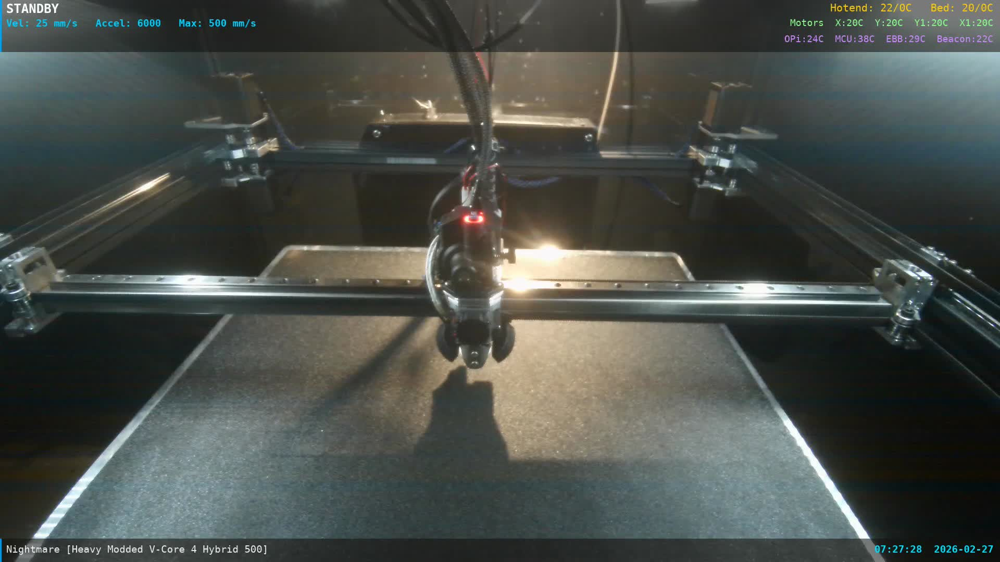

# Camera Overlay System

Custom overlay stream that combines the 3DO USB Camera V2 feed with live printer status information (temps, motion, progress) and serves it via WebRTC for low-latency viewing. Runs as systemd services on the printer's Orange Pi 5 Pro.



## Architecture

```
ustreamer (port 8083, localhost only, 1080p 30fps MJPEG, HW encode via camera)
    -> ffmpeg (SW decode + drawbox/drawtext overlay filters + h264_rkmpp HW encode)
    -> raw H.264 pipe to stdout
    -> go2rtc (exec source, reads pipe, serves WebRTC/MSE/HLS)
    -> browsers connect via WebRTC
```

**On-demand:** ffmpeg only runs when a viewer connects. go2rtc manages the ffmpeg lifecycle via its `exec:` source — when no viewers are connected, ffmpeg is not running and CPU usage is 0%.

## Services

| Service | What it runs | Lifecycle |
|---------|-------------|-----------|
| `crowsnest.service` | ustreamer (1080p MJPEG capture) | Always running |
| `camera-overlay.service` | `overlay_status.py` (Moonraker API poller) | Always running |
| `go2rtc.service` | go2rtc v1.9.14 (manages ffmpeg exec, serves WebRTC) | Always running, ffmpeg on-demand |

## Endpoints

| URL | Description |
|-----|-------------|
| `http://YOUR_PRINTER_IP:1984/` | go2rtc web UI (stream list, player) |
| `http://YOUR_PRINTER_IP:1984/stream.html?src=printer_cam` | WebRTC player page |
| `http://YOUR_PRINTER_IP:1984/api/ws?src=printer_cam` | WebRTC WebSocket (used by Fluidd) |
| `http://YOUR_PRINTER_IP:8083/?action=snapshot` | JPEG snapshot (raw camera, no overlay) |
| `http://YOUR_PRINTER_IP:8083/?action=stream` | Raw ustreamer MJPEG (localhost only) |

## Files on Printer

Located at `/home/pi/camera-overlay/`:

| File | Description |
|------|-------------|
| `start.sh` | Entrypoint for camera-overlay.service, runs overlay_status.py |
| `ffmpeg_overlay.sh` | ffmpeg pipeline (called by go2rtc exec), outputs raw H.264 to stdout |
| `go2rtc.yaml` | go2rtc configuration (exec source, WebRTC, API) |
| `overlay_status.py` | Polls Moonraker API, writes status text files every ~1s |
| `status/` | Text files read by ffmpeg drawtext filters (reload=1) |
| `hls_server.py` | OLD HLS server (no longer used, kept for reference) |

Other locations:
- go2rtc binary: `/usr/local/bin/go2rtc` (v1.9.14, ARM64 static binary)
- ffmpeg: `/usr/lib/jellyfin-ffmpeg/ffmpeg` (jellyfin-ffmpeg 7.1.3, has rkmpp support)
- Services: `/etc/systemd/system/camera-overlay.service`, `/etc/systemd/system/go2rtc.service`

## Current ffmpeg Settings

| Parameter | Value |
|-----------|-------|
| Input | 1920x1080 MJPEG from ustreamer (SW decode) |
| Encoder | h264_rkmpp (Rockchip VPU hardware H.264) |
| Bitrate | 4 Mbps |
| GOP | 30 frames (keyframe every 1s at 30fps) |
| B-frames | 0 |
| Low-latency flags | `-fflags nobuffer -flags low_delay` |
| Output | Raw H.264 annex-b to stdout (`-f h264 -`) |

## Performance

| Metric | go2rtc + WebRTC (current) | HLS (previous) | SW MJPEG (original) |
|--------|--------------------------|-----------------|---------------------|
| Resolution | 1080p | 4K | 4K |
| ffmpeg CPU | ~47% (on-demand) | ~159% (always-on) | ~500% |
| System idle | ~86% | ~64% | ~13% |
| Latency | ~200-500ms | ~2-3s | ~1s |

## Overlay Layout

- **Top bar** (100px, semi-transparent black, blue left accent 3px):
  - Row 1 (y=7): printer status (left, white 24pt bold), heater temps (right, yellow 20pt)
  - Row 2 (y=37): motion info (left, cyan 19pt bold), motor temps (right, green 18pt)
  - Row 3 (y=67): system temps (right, purple 18pt)
- **Bottom bar** (45px): filename (left, white 19pt), progress (right, cyan 19pt bold)
- Font: DejaVu Sans Mono (Bold + Regular)

## Fluidd Webcam Configuration

| Setting | Value |
|---------|-------|
| Name | `overlay_cam` |
| Service | `webrtc-go2rtc` |
| Stream URL | `http://YOUR_PRINTER_IP:1984/api/ws?src=printer_cam` |
| Snapshot URL | `http://YOUR_PRINTER_IP:8083/?action=snapshot` |

## Known Issues

### rkmpp MJPEG Encoder is Broken
The `mjpeg_rkmpp` encoder doesn't byte-stuff entropy data and omits EOI markers. Browsers refuse to render the output. This is a fundamental MPP library bug, not fixable by rebuilding ffmpeg. Use `h264_rkmpp` instead.

### ffmpeg Dual-Output Segfault
Using two `-vf` flags (one per output) in jellyfin-ffmpeg 7.1.3 causes segfault (exit 139). Use single output only; snapshots are proxied from ustreamer separately.

### ffmpeg -y Flag Required
Without `-y`, ffmpeg prompts to overwrite existing files and exits in non-interactive service context.

## Software Requirements

- **go2rtc:** v1.9.14 at `/usr/local/bin/go2rtc` (ARM64 static binary, has Rockchip presets)
- **ffmpeg:** jellyfin-ffmpeg 7.1.3 at `/usr/lib/jellyfin-ffmpeg/ffmpeg` (has `--enable-rkmpp --enable-rkrga`)
- **ustreamer:** For camera capture (via crowsnest)
- **Kernel:** Must have `/dev/mpp_service` (Rockchip MPP device)
- **Fonts:** `fonts-dejavu-core` package

## Migration History

1. **Original:** Software MJPEG relay (~500% CPU, ~1s latency)
2. **Feb 2026:** h264_rkmpp + HLS via hls_server.py (~159% CPU, ~2-3s latency)
3. **Feb 24 2026:** go2rtc + WebRTC, downgraded to 1080p (~47% CPU on-demand, ~200-500ms latency)
