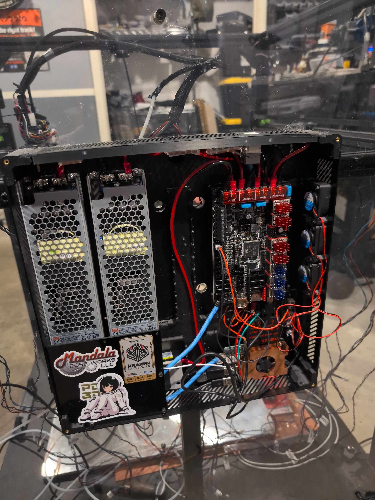
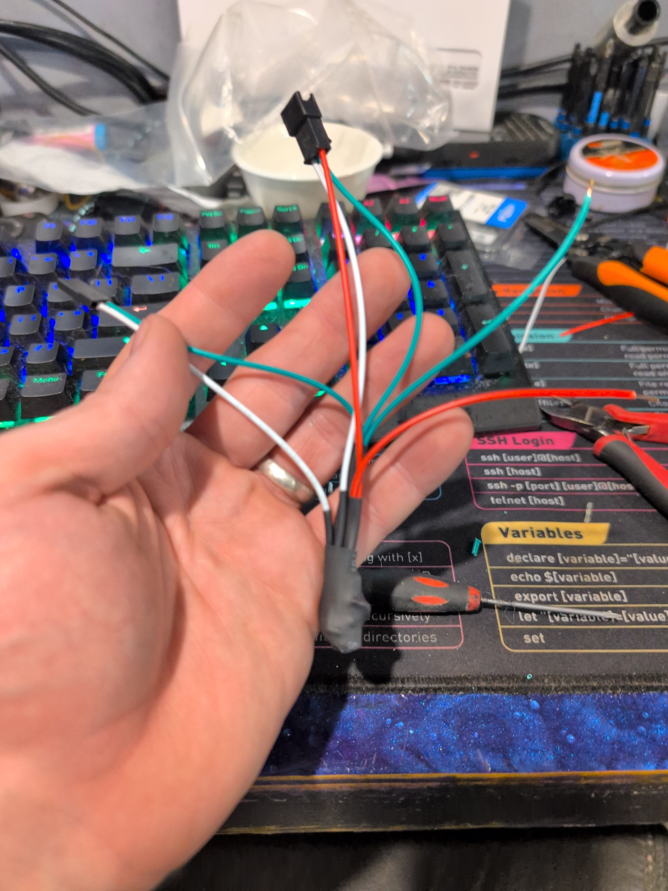

# Wiring Reference

*Electronics enclosure — dual Mean Well PSUs (UHP-350-55 + UHP-350-24), Octopus Pro H723 with TMC5160T Pro drivers, early wiring before stepper connections.*

## Octopus Pro H723 — Motor Slot Assignments

| Motor Slot | Stepper | Motor Model | Notes |
|-----------|---------|-------------|-------|
| MOTOR 0 | stepper_x | LDO Kraken V2 | Bottom left, TMC5160 SPI |
| MOTOR 1 | stepper_y | LDO Kraken V2 | Top left, TMC5160 SPI |
| MOTOR 3 | stepper_y1 | LDO Kraken V2 | Top right, TMC5160 SPI |
| MOTOR 4 | stepper_x1 | LDO Kraken V2 | Bottom right, TMC5160 SPI |
| MOTOR 5 | stepper_z | LDO Z motor | Left leadscrew, TMC2209 UART |
| MOTOR 6 | stepper_z1 | LDO Z motor | Rear leadscrew, TMC2209 UART |
| MOTOR 7 | stepper_z2 | LDO Z motor | Right leadscrew, TMC2209 UART |

## EBB42 v1.2 — Pin Assignments

| Function | Pin | Notes |
|----------|-----|-------|
| Extruder step | PD0 | |
| Extruder dir | PD1 | |
| Extruder enable | PD2 | |
| Extruder UART | PA15 | TMC2209 |
| Heater | PB13 | Chube Air hotend |
| Thermistor | PA3 | PT1000 + 2.2K pullup |
| Part cooling fan | PA0 | Inverted PWM |
| Hotend fan | PA1 | Always-on with heater |
| X endstop | PB6 | Physical endstop |
| Filament sensor | PB3 | With pull-up (^) |
| Filament button | PB4 | Tangle/unload |
| ADXL345 CS | PB12 | SPI accelerometer |
| ADXL345 MOSI | PB11 | |
| ADXL345 MISO | PB2 | |
| ADXL345 SCLK | PB10 | |

## Octopus Pro — Other Pin Assignments

| Function | Pin | Notes |
|----------|-----|-------|
| Heated bed heater | PA1 | |
| Heated bed thermistor | PF3 | |
| Neopixel data | PB10 | Via SN74AHCT125N level shifter |
| Chamber light | PB0 | HE2 output (HE3/PB11 dead) |
| Enclosure intake fan | PD12 | FAN2, always-on, 24V on HV stepper driver |
| Controller fan | PD13 | FAN3, auto with steppers |
| Enclosure exhaust fan | PE5 | FAN5, always-on, 24V on HV stepper driver |
| SPI MOSI | PA7 | For TMC5160 |
| SPI MISO | PA6 | For TMC5160 |
| SPI SCLK | PA5 | For TMC5160 |

## Therm^2 — Motor Thermistor Mapping

| Input | Pin | Motor | Position |
|-------|-----|-------|----------|
| th4 | PA0 | stepper_x | Bottom left |
| th5 | PA1 | stepper_y | Top left |
| th6 | PA2 | stepper_y1 | Top right |
| th7 | PA3 | stepper_x1 | Bottom right |

All thermistors are 100K NTC (Generic 3950). Use th4-th7 NTC inputs, NOT th0-th3 PT1000 inputs.

## Status LED Level Shifter — SN74AHCT125N Wiring

The WS2812B LEDs require 5V data signal but the Octopus Pro outputs 3.3V. A unidirectional SN74AHCT125N level shifter converts the signal. Do NOT use bi-directional shifters (BSS138, TXB0104, TXS0108E) — they are too slow for the 800kHz neopixel protocol.

| SN74AHCT125N Pin | Connection | Notes |
|------------------|------------|-------|
| Pin 1 (1OE) | GND | Enable gate 1 (active low) |
| Pin 2 (1A) | Octopus PB10 | 3.3V neopixel data input |
| Pin 3 (1Y) | LED strip DIN | 5V neopixel data output |
| Pin 7 (GND) | GND | Ground |
| Pin 14 (VCC) | 5V | Power (from 5V buck) |

Add a 10nF ceramic bypass capacitor between VCC (pin 14) and GND (pin 7), as close to the chip as possible.

## Dir Pin Inversions

| Stepper | Dir Pin | Inverted? |
|---------|---------|-----------|
| stepper_x | x_dir_pin (PF12) | No |
| stepper_x1 | x1_dir_pin (PF10) | No |
| stepper_y | y_dir_pin (PG1) | Yes (!) |
| stepper_y1 | y1_dir_pin (PC1) | No |
| stepper_z | z0_dir_pin (PF0) | Yes (!) |
| stepper_z1 | z1_dir_pin (PE3) | Yes (!) |
| stepper_z2 | z2_dir_pin (PA14) | Yes (!) |
